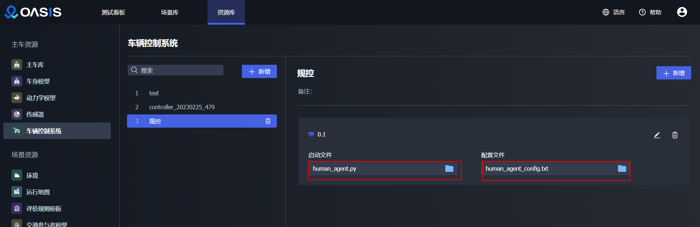

[上一页：比赛介绍](README.md)

***

## 2.1 开发环境配置

### 2.1.1 环境要求
- 操作系统：推荐 Ubuntu 20.04 LTS
- 内存：16GB及以上
- CPU：6核及以上
- 显存：8GB及以上
- 开发语言：Python 3.8

### 2.1.2 下载Oasis竞赛版压缩包

[点击这里下载 Oasis 竞赛版压缩包](https://carsmos.oss-cn-chengdu.aliyuncs.com/Oasis-bisai.tar.gz)，压缩包里面包含：
- 安装所需镜像 tar 包
- 一键部署脚本
- Oasis 竞赛版使用手册
- Oasis 竞赛版部署要求文档
- 动力学参数标定表等

### 2.1.3 运行一键部署脚本，安装 Oasis 竞赛版

- 根据部署要求文档，准备 Oasis 竞赛版所要安装的环境

- 运行一键部署脚本，即可将 Oasis 竞赛版安装完毕

```bash
./install.sh
```

### 2.1.4 运行示例

- 可直接通过桌面图标 `Oasis` 进入Oasis竞赛版

- 配置场景，加载预置或者自定义的 your_agent.py 文件，创建任务即可开始仿真

- 运行结束，可查看任务运行结果，评价指标，获取传感器数据，查看任务运行视频

## 2.2 开始开发

### 2.2.1 基于 Autonomous Agent 创建 Agent

参赛选手需要在 Oasis 竞赛版指定的 **team_code** 目录下，创建 **your_agent.py** 作为代码入口，用于执行自动驾驶算法。比赛系统将会使用算法依次运行多个预置的场景下，生成任务结果，评估参赛选手的自动驾驶算法。

参赛选手所创建的 your_agent.py 需要通过继承 AutonomousAgent 类进行开发，可以在 autoagents/autonomous_agent.py 中找到 AutonomousAgent 类，这里规定了所有必须的接口，需要在 **your_agent.py** 中重写这些函数，接入自动驾驶算法模块。

```python
from autoagents.autonomous_agent import AutonomousAgent

class YourAgent(AutonomousAgent):
    def __init__(self, debug=False):
```

### 2.2.2 重写 setup 方法

参赛选手需要在 **your_agent.py** 中重写 setup 方法，此方法会在场景任务运行之前，执行 agent 所需要的所有初始化，它将在每次加载新的场景时被自动调用。

如果 your_agent.py 需要加载配置文件，请通过 *path_to_conf_files* 来指定配置文件的路径，否则请忽略。

同时，如果需要，可以将经纬度参考属性加载到 setup 方法中，它们会在 setup 运行之前就被更新，这两个属性是将 waypoint 坐标转换成 carla 坐标的参考值。

```python
#latitude and longitude reference
lat_ref = None
lon_ref = None
class YourAgent(AutonomousAgent):
    def __init__(self, debug=False):
		``````
    def setup(self, destination, path_to_conf_file):
        """
        Setup the agent parameters
        """
        global lat_ref, lon_ref
        lat_ref = self.lat_ref
        lon_ref = self.lon_ref
        ........

```

参赛选手可以参考以下函数 `from_gps_to_world_coordinate` 将 gps 数据转换为世界坐标：

```python
def from_gps_to_world_coordinate(lat, lon):
    global lat_ref, lon_ref

    EARTH_RADIUS_EQUA = 6378137.0  # pylint: disable=invalid-name
    scale = math.cos(lat_ref * math.pi / 180.0)
    mx_initial = scale * lon_ref * math.pi * EARTH_RADIUS_EQUA / 180.0
    my_initial = (
        scale
        * EARTH_RADIUS_EQUA
        * math.log(math.tan((90.0 + lat_ref) * math.pi / 360.0))
    )

    mx = lon / 180.0 * (math.pi * EARTH_RADIUS_EQUA * scale)
    my = math.log(math.tan((lat + 90.0) * math.pi / 360.0)) * (
        EARTH_RADIUS_EQUA * scale
    )
    x = mx - mx_initial
    y = -(my - my_initial)

    return [x, y]

```

### 2.2.3 重写 sensors 方法

参赛选手必须要重写 sensors 方法，该方法定义了 agent 能够使用的所有传感器。

在 Oasis 竞赛版中，your_agent.py 中的 sensors 可直接在 Oasis 竞赛版系统 - 资源库中进行配置，以调试得到适合参赛选手算法的最优传感器配置，在提交到云端时，参赛选手需要将最优的传感器配置写入 your_agent.py 中的 sensors 方法中，进行提交。

传感器参数配置可以参考 AutonomousAgent 中的示例内容进行配置，同时我们对传感器的可选类型与可配置数量做了限制，请参考下述内容

| 可搭载传感器                | 可搭载数量 |
| --------------------- | ----- |
| sensor.camera.rgb     | 4     |
| sensor.other.radar    | 2     |
| sensor.other.gnss     | 1     |
| sensor.other.imu      | 1     |
| sensor.opendrive_map  | 1     |
| sensor.lidar.ray_cast | 1     |
| sensor.speedometer    | 1     |

```python

def sensors(self):
        """Define the sensor suite required by the agent"""
        sensors = [
                {'type': 'sensor.camera.rgb', 'x': 0.7, 'y': 0.0, 'z': 1.60, 'roll': 0.0, 'pitch': 0.0, 'yaw': 0.0,
                'width': 800, 'height': 600, 'fov': 100, 'id': 'Center'},
                {'type': 'sensor.lidar.ray_cast', 'x': 0.7, 'y': -0.4, 'z': 1.60, 'roll': 0.0, 'pitch': 0.0,
                'yaw': -45.0, 'id': 'LIDAR'},
                {"type": "sensor.speedometer", "id": "Speed"},
                {'type': 'sensor.opendrive_map', 'reading_frequency': 1, 'id': 'OpenDRIVE'},
                {'type': 'sensor.other.radar', 'x': 0.7, 'y': -0.4, 'z': 1.60, 'roll': 0.0, 'pitch': 0.0,
                'yaw': -45.0, 'id': 'RADAR1','horizontal_fov':30,'vertical_fov':30},
                {'type': 'sensor.other.gnss', 'x': 0.7, 'y': -0.4, 'z': 1.60, 'id': 'GPS'},
                {'type': 'sensor.other.imu', 'x': 0.7, 'y': -0.4, 'z': 1.60, 'roll': 0.0, 'pitch': 0.0,
                'yaw': -45.0, 'id': 'IMU'},
            ]
        return sensors
```

每个传感器由一个 dict 表示，包含以下字段：

- `type`：要添加的传感器的类型。

- `id`：将被赋予传感器的标签，以便以后访问。

- `attributes`：这些属性与传感器有关，例如：外在因素和视野等。

参赛选手可以设置每个传感器的内在参数和外在参数（位置和方向），以相对于车辆的中心坐标为准。请注意，CARLA 使用 UE4 的左手坐标系统，即：X-前，Y-右，Z-上。

传感器具体解释如下：

- [`sensor.camera.rgb`](https://carla.readthedocs.io/en/0.9.10/ref_sensors/#rgb-camera) - 捕捉图像的普通相机。

- [`sensor.lidar.ray_cast`](https://carla.readthedocs.io/en/0.9.10/ref_sensors/#lidar-sensor) - Velodyne 64 激光雷达。

- [`sensor.other.radar`](https://carla.readthedocs.io/en/0.9.10/ref_sensors/#radar-sensor) - 远程雷达（最远100米）。

- [`sensor.other.gnss`](https://carla.readthedocs.io/en/0.9.10/ref_sensors/#gnss-sensor) - 返回地理位置数据的GPS传感器。

- [`sensor.other.imu`](https://carla.readthedocs.io/en/0.9.10/ref_sensors/#imu-sensor) - 六轴惯性测量单元。

- `sensor.opendrive_map` - 伪传感器，以OpenDRIVE格式解析为字符串的高清地图。

- `sensor.speedometer` - 伪传感器，提供线性速度的近似值。

> 如果尝试使用其他传感器或传感器参数名称错误，会使传感器设置失败。

> 如果在提交中使用了超量的传感器，传感器配置验证失败，运行会出错。

此外，还有一些空间限制，限制了传感器在车辆包围盒内的位置。如果一个传感器在任何轴线上与主车相距超过3米（例如：`[3.1,0.0,0.0]`），设置将失败。

### 2.2.4 重写 run_step 方法

这个方法将在每个 world tick 被调用一次，产生一个新的动作，其形式为 `carla.VehicleControl` 对象。确保该函数返回控制对象，该对象将被用于更新仿真主车。

参赛选手可以在 run_step 中开发算法，并必须确保函数返回的是 `carla.VehicleControl` 对象，该返回对象将用于控制仿真主车运动。

```python
    def run_step(self, input_data, timestamp):
        """
        Execute one step of navigation.
        :return: control
        """
        # do something smart

        control = carla.VehicleControl()
        control.steer = 0.0
        control.throttle = 0.0
        control.brake = 0.0
        control.hand_brake = False

        return control

```

- `input_data`: 是一个在每一个 world tick 中返回所搭载的传感器数据的字典。这些数据以 numpy 数组的形式给出。 这个字典由传感器方法中定义的 id 来索引。

- `Timestamp`：当前仿真世界时间帧号。

### 2.2.5 重写 destroy 方法

在每个场景任务结束时，destroy 方法将被调用，需要参赛选手重写 destroy 方法来结束相应的进程或线程。

```python
def destroy(self):
    # destroy process 
    pass
```

## 2.3 基于 Dora 开发

### 2.3.1 Dora简介
我们推荐使用 Dora 开发算法代码，详情请参考：
- [**Dora**](https://github.com/dora-rs/dora)
- [**Dora-drives**](https://github.com/dora-rs/dora-drives)

### 2.3.2 在 Dora 中替换算法

想要将自己的算法（操作符）添加到节点流中，只需要在数据流中创建新的节点即可。我们以添加 yolov5 目标检测操作符为例，该算法已经在dora-drives/operators/yolov5_op.py中编写好。

```python
import os
from typing import Callable

import cv2
import numpy as np
import torch
from dora import DoraStatus

DEVICE = os.environ.get("PYTORCH_DEVICE") or "cpu"

class Operator:
    """
    Infering object from images
    """

    def __init__(self):
        self.model = torch.hub.load(
            "ultralytics/yolov5",
            "yolov5n",
        )
        self.model.to(torch.device(DEVICE))
        self.model.eval()

    def on_input(
        self,
        dora_input: dict,
        send_output: Callable[[str, bytes], None],
    ) -> DoraStatus:
        """Handle image
        Args:
            dora_input["id"](str): Id of the input declared in the yaml configuration
            dora_input["data"] (bytes): Bytes message of the input
            send_output (Callable[[str, bytes]]): Function enabling sending output back to dora.
        """

        frame = cv2.imdecode(
            np.frombuffer(
                dora_input["data"],
                dtype="uint8",
            ),
            -1,
        )
        frame = frame[:, :, :3]

        results = self.model(frame)  # includes NMS
        arrays = np.array(results.xyxy[0].cpu())[
            :, [0, 2, 1, 3, 4, 5]
        ]  # xyxy -> xxyy
        arrays[:, 4] *= 100
        arrays = arrays.astype(np.int32)
        arrays = arrays.tobytes()
        send_output("bbox", arrays, dora_input["metadata"])
        return DoraStatus.CONTINUE
```

参赛选手只需要重写 __init__ 方法和 on_input 方法，init 方法会在初始化节点调用，执行操作符所需要的所有初始化和定义；on_input 方法会在每个时间步长中调用一次，参赛选手需要在配置数据流的 yaml 文件中定义入参 inputs 和输出 outputs 的内容。如果成功，返回 CONTINUE 标志；

如果想运行算法操作符，参赛选手只需要将它们添加到节点图中去：

```yaml
communication:
  iceoryx:
    app_name_prefix: dora-iceoryx-example

nodes:
  - id: webcam
    operator:
      python: ../../operators/webcam_op.py
      inputs:
        tick: dora/timer/millis/100
      outputs:
        - image

  - id: yolov5
    operator: 
      outputs:
        - bbox
      inputs:
        image: webcam/image
      python: ../../operators/yolov5_op.py

  - id: plot
    operator:
      python: ../../operators/plot.py
      inputs:
        image: webcam/image
        obstacles_bbox: yolov5/bbox
        tick: dora/timer/millis/100
```

- `nodes`：要运行的节点群

- `id`    ：的节点id

- `python`：要运行的代码文件

- `inputs`： 当前节点的输入

- `outputs`：当前节点的输出

输入以节点名为前缀，以便能够避免名称冲突。

参赛选手可以在 docker 中使用以下命令，来运行算法：

```bash
./scripts/launch.sh -b -g tutorials/webcam_yolov5.yaml
```

> 更加详细的有关 Dora 的内容请参考：[**Dora 文档**](https://dora-rs.github.io/dora-drives/introduction.html)

## 2.4 训练和测试算法
将 your_agent.py 和相关配置文件以及代码复制到 Oasis竞赛版安装映射的本机路径 team_code 目录下

```bash
cp your_agent.py {YOUR_PATH}/oasis/team_code
cp YOUR_CONFIG {YOUR_PATH}/oasis/team_code
```

在 Oasis 竞赛版中选取 your_agent.py 和相关配置文件，创建作业和运行，如图所示。

  

 Oasis 竞赛版中准备了一套预定义的场景，参赛选手可以使用这些场景来训练和验证算法。场景可以在 *Oasis 竞赛版 - 场景库* 中找到。

***

[上一页：比赛介绍](README.md)

[下一页：比赛规则](rules.md)