[上一页：比赛介绍](README.md)

***
# 2 安装部署

## 2.1 预置条件
- `操作系统`：推荐 `Ubuntu 20.04`。

- `存储和内存`

  - `硬盘`：建议预留 `60GB` 以上的硬盘空间

  - `内存`：建议内存不少于 `16GB`

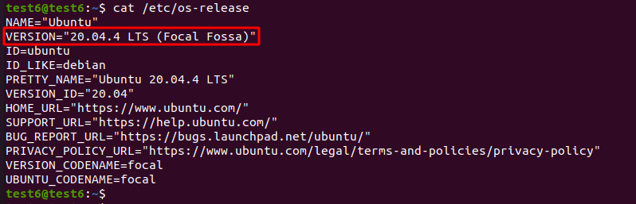

- `显卡型号`：推荐 `nvidia 3060` 以上


- `显卡驱动版本`：推荐 `510.108` 及以上，CUDA版本 `11.4` 及以上


- `Docker`：推荐版本 `20.10` 及以上


- `Docker-compose` 版本要求 `1.29.2` 及以上

- `开发语言`：建议使用 `Python 3.7` 作为开发语言


## 2.2 安装步骤

安装前请确保防火墙关闭。执行 `sudo ufw status`命令查看防火墙状态，默认关闭。

```shell
sudo ufw status
Status: inactive
```
如果是开启状态 `active`，那么执行下面命令关闭防火墙。

```shell
sudo ufw disable
```

如果不支持 `ufw` 命令，那么先执行下面命令进行安装

```shell
sudo apt install ufw
```

### 2.2.1 下载解压安装包

```shell
wget https://carsmos.oss-cn-chengdu.aliyuncs.com/carsmos.tar.gz
tar -xzvf carsmos.tar.gz
```

进入 `carsmos` 文件夹，目录结构如下：
```bash
.
├── oasis
│   ├── carla ·························· Oasis Carla 模块
│   ├── database ······················· Oasis Database 模块
│   ├── doc ···························· 安装说明文档
│   ├── install.sh ····················· 安装 Oasis 的脚本
│   ├── oasis-electron-linux ··········· Oasis Electron 模块
│   ├── oasis-web ······················ Oasis Web 模块
│   ├── public ························· 离线安装 docker/docker-compose/openssh-server
│   ├── service_module ················· Oasis 服务模块
│   └── uninstall.sh ··················· 卸载 Oasis 的脚本
├── team_code
│   ├── dependencies ··················· 将依赖和算法模型放这里
│   └── dora-drives ···················· 在这里开发程序
└── upload.sh ·························· 上传算法的脚本

```

### 2.2.2 执行安装脚本

执行 `install.sh` 脚本。

```shell
./install.sh
```

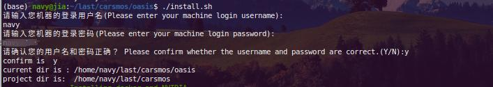

安装过程会持续半小时左右，请耐心等待。

> 提示：不支持通过 `Xshell`、`PuTTY` 等远程连接工具安装，需在本机执行安装脚本。

<!-- > 提示：如果执行安装脚本显示 `Permission denied`，请参考如下命令将用户加入 `docker` 组，从而解决权限问题
```shell
sudo gpasswd -a $USER docker
newgrp docker
``` -->

### 2.2.3 添加图标权限

安装完成后，会在桌面有个图标，右键选择允许运行

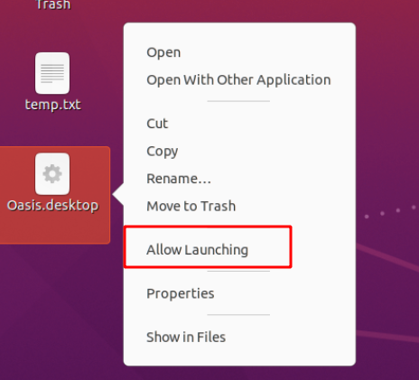

图标会变为下图


## 2.3 登录使用
### 2.3.1 申请并配置 license

参考：[License导入说明](license.md)

> 请注意：需要在 [**比赛报名系统**](https://race.carsmos.cn) 中申请参赛并且审核通过之后，才可以申请 license。

<!-- 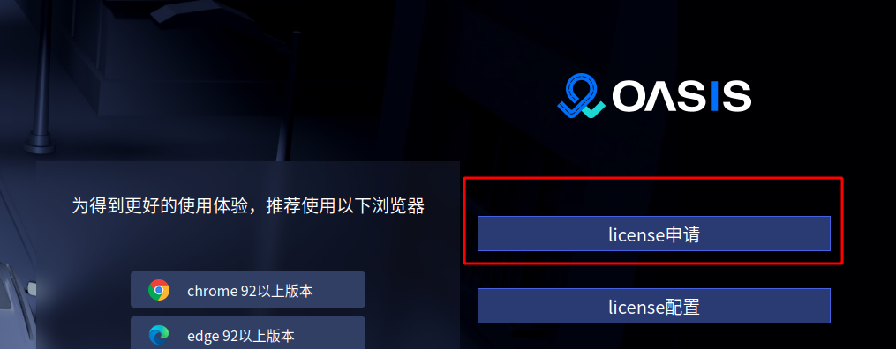

按照如下流程申请

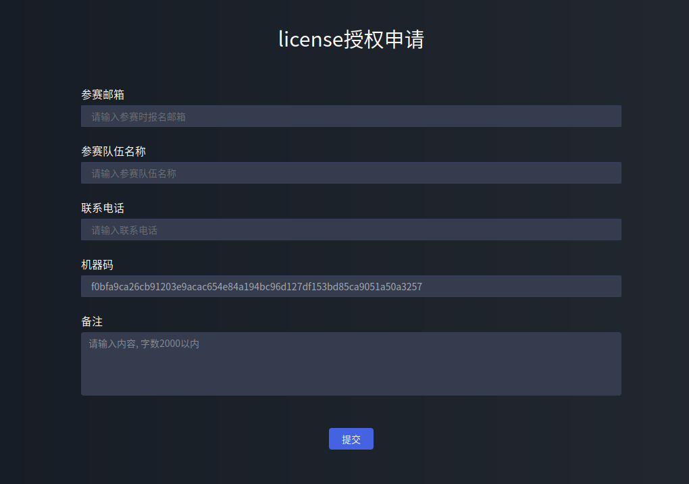

点击 `提交` 后， 并把 license 下载到本地。

## 3.2 配置 license

选择 license 配置后，选择上面步骤下载的  lincense。

 -->
### 2.3.2 进入启动页面

点击启动按钮，即可进入 oasis 仿真平台。

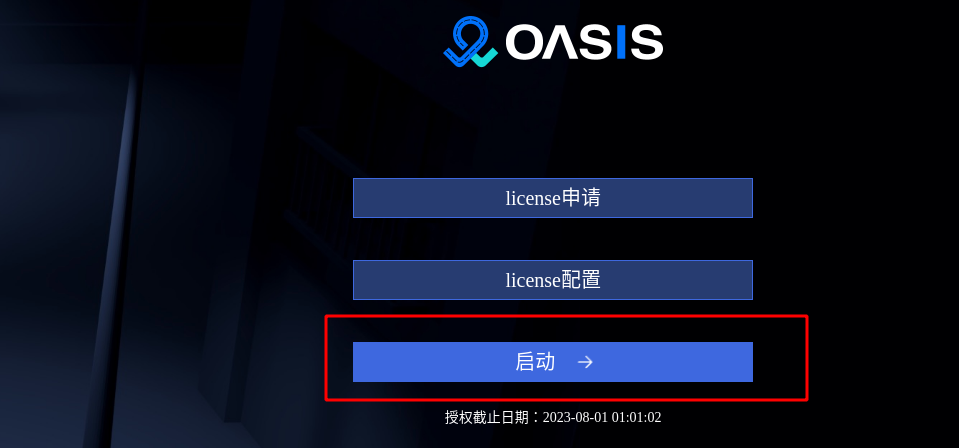

### 2.3.3 运行示例

- 直接通过桌面图标 `Oasis` 进入 `Oasis` 竞赛版

- 点击 `启动` 进入 `Oasis` 竞赛版系统

  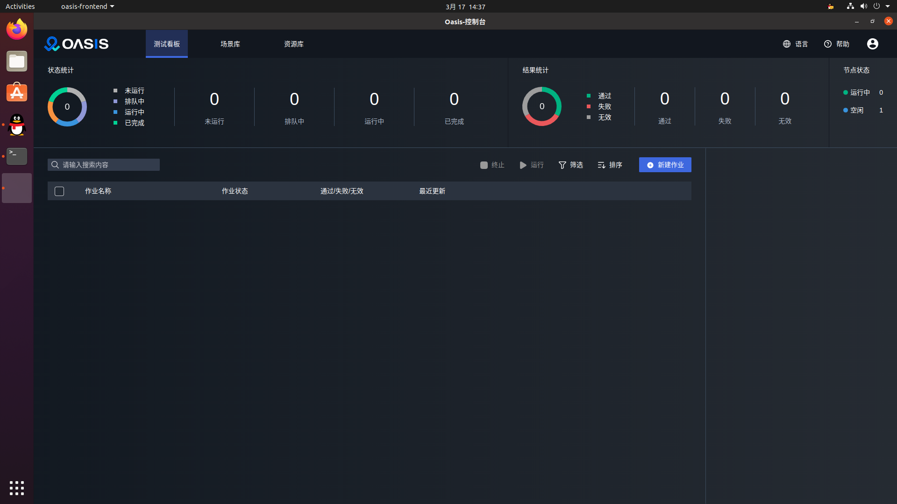

- 点击新建作业

  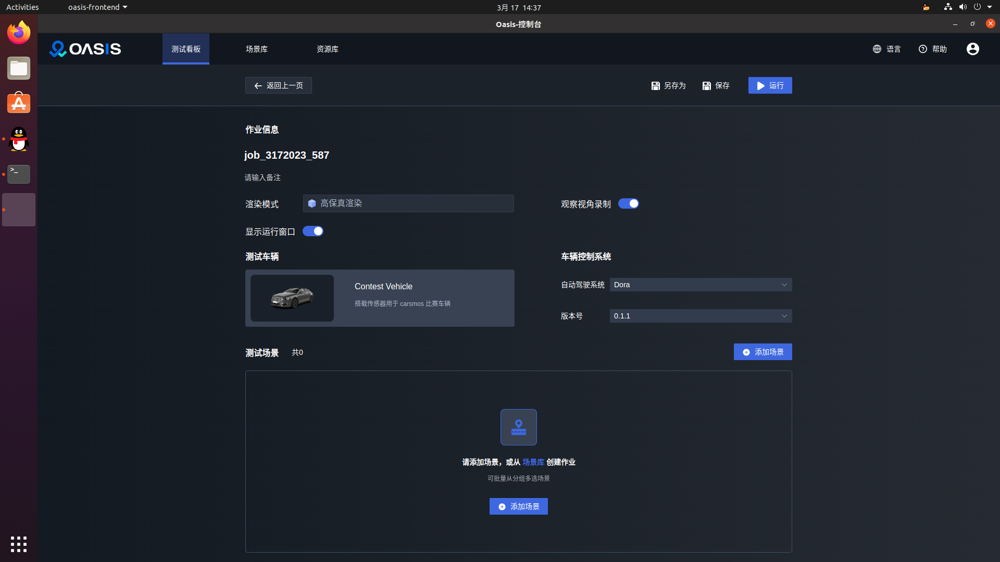

- 可选择是否显示运行窗口、是否录制，以及自动驾驶系统和版本。然后选择添加场景
  
  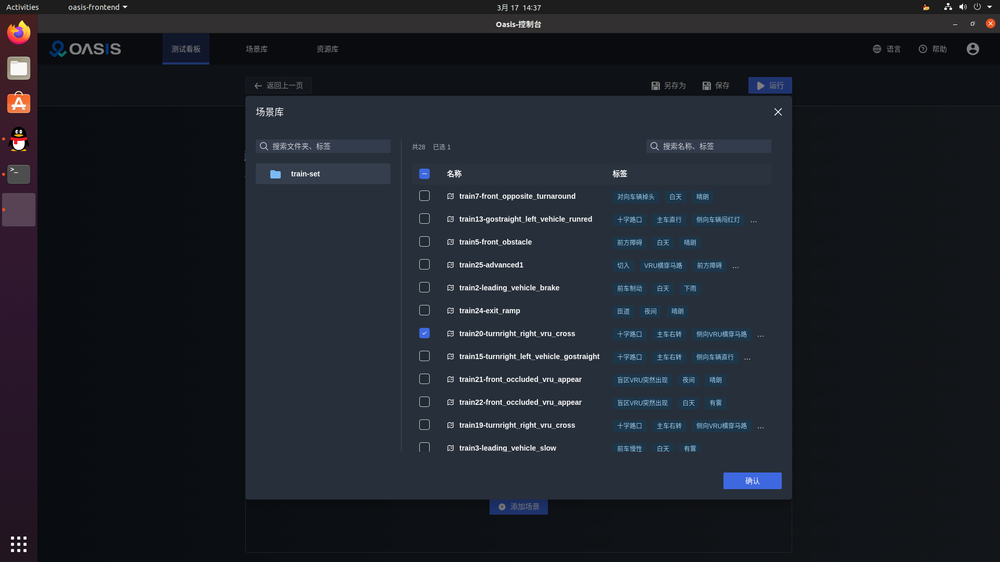

- 选择若干个场景，点击确认

  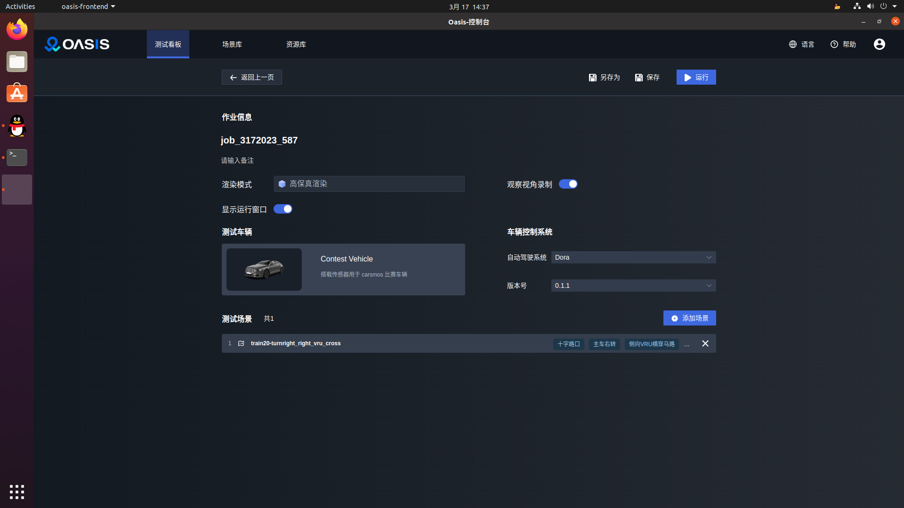

- 点击 `运行` ，任务加入队列，稍等就会出现运行窗口

  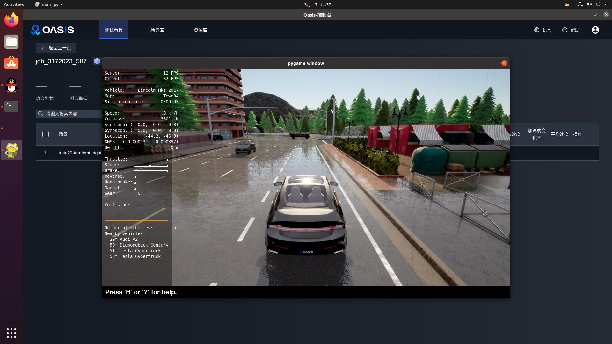

- 运行结束，可查看任务运行结果，评价指标，获取传感器数据，查看任务运行视频

  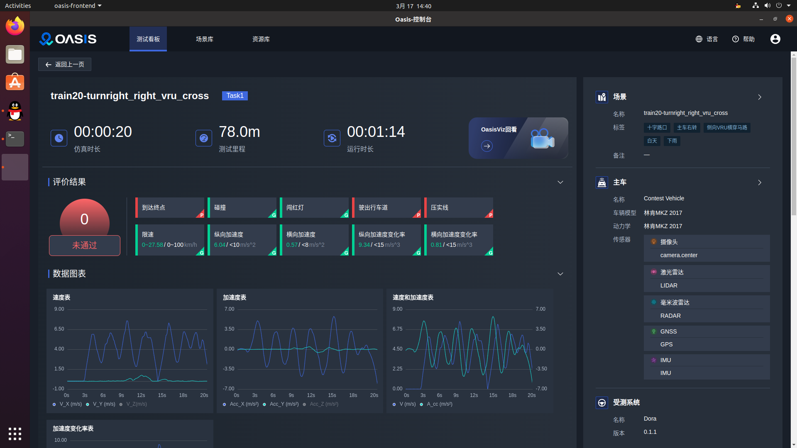

> 运行完第一次后，建议先进行一次提交。第一次提交会花费较多时间，后续提交则会很快，参考：[提交算法](submit.md)

## 2.4 卸载
进入 oasis 目录执行
```shell
cd  carsmos/oasis
./uninstall.sh
```

## 2.5 产品说明
Oasis 仿真测试产品包含以下模块：

- Carla
- Database
- Services
- Web

用到的中间件以及工具组件：

- docker
- nvidia-docker
- docker-compose
- nginx
- etcd
- redis
- mysql
- influxdb
- Vue 
- ElementUI 
- Echarts 
- ThreeJS 
- Electron 
- WangEditor 
- LibOpenDrive 
- CodeMirror

推荐的系统版本配置：

- Ubuntu 20.04
- NVIDIA 3060
- NVIDIA 驱动 510.108

## 2.6 安装模块说明
### 2.6.1 Carla
执行仿真测试的组件，该目录下包含Carla安装所需的脚本文件和安装包。
### 2.6.2 Database
数据库及中间件组件：包含 mysql、Redis、etcd、influxdb：

- mysql 存储的是整个仿真测试的运行结果；
- influxdb 存储的是图表展示所需的测试数据；
- Redis 存储的是运行任务的过程信息；
- etcd 做为任务调度中间件使用；

该目录下包含所有对应组件的安装包和安装脚本。
### 2.6.3 Services
服务组件包含 5 大模块；

- oasis-simulate 负责与仿真器的交互，运行测试用例以及结果的收集；
- oasis-viz 负责对场景运行过程的传感器相关数据收集及显示；
- oasis-data 负责对场景运行过程中视频的录制和回放；
- oasis-task-manager 负责整个测试任务的调度，流程控制；
- oasis-server 整个仿真测试平台的 web 服务器，负责处理页面的下发的请求；

该目录下包含所有对应组件的安装包和安装脚本。
### 2.6.4 Oasis-web
界面展示组件，负责作业生成、下发以及运行结果的展示。
该目录下包含对应组件的安装包和安装脚本。

### 2.6.5 Oasis-electron-linux
桌面快捷方式组件，双击可打开 oasis-web。

### 2.6.6 Public
公共组件，包含 docker、nvidia-docker、docker-compose、openssh 的安装包和安装脚本。

## 2.7 本地存储目录说明

- /oasisdata/data： 视频回放、传感器相关数据；
- /oasisdata/log： 视频回放、传感器相关日志；
- /oasisviz/data： 测试回放数据；
- /oasisviz/log： 测试回放模块日志；
- /opt/db_data/etcd：中间件 etcd 存储路径；
- /opt/db_data/influx：数据库 influx 存储路径；
- /opt/db_data/mysql：数据库 mysql 存储路径；
- /opt/db_data/redis：数据库 redis 存储路径；


***

[上一页：比赛说明](README.md)

[下一页：开发指引](start.md)


