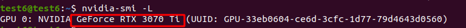
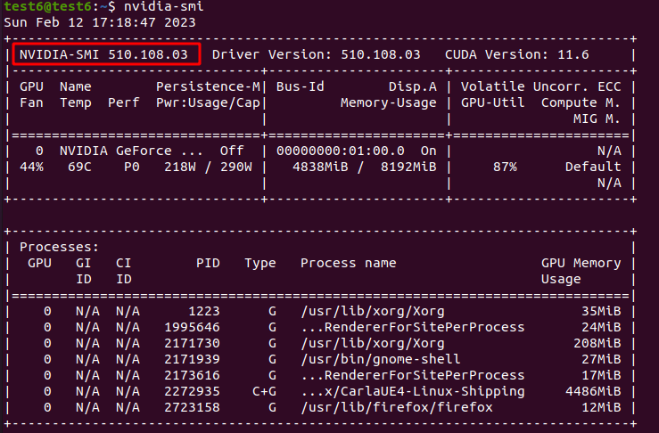
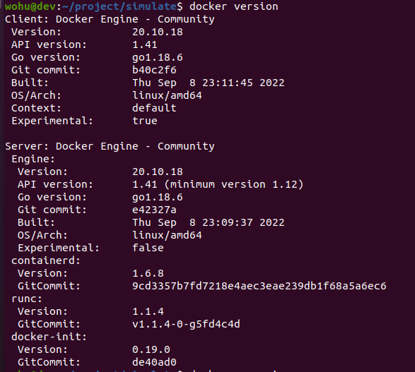
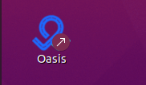
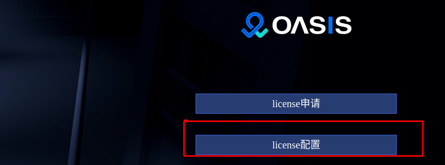

[上一页：比赛介绍](README.md)

***
# 2. Installation and Deployment

## 2.1 Prerequisites
### 2.1.1 Operating System
The recommended operating system is Ubuntu 20.04.

### 2.1.2 Storage and Memory
- Hard disk: It is recommended to reserve more than 60GB of disk space.
- Memory: It is recommended to have a memory of no less than `16GB`.


### 2.1.3 Graphics Card Model
The recommended graphics card model is nvidia `3060` or above.


### 2.1.4 Graphics Card Driver Version
The recommended graphics card driver version is `510.108` or above, and the CUDA version is `11.4` or above.


### 2.1.5 Docker Version
The recommended Docker version is `20.10` or above.


### 2.1.6 Programming Language
It is recommended to use `Python 3.7` as the programming language.

## 2.2 Installation Steps
Before installation, make sure that the firewall is turned off. Use the command `sudo ufw status` to check the firewall status. By default, it is turned off.

```shell
sudo ufw status
Status: inactive
```
If it is in the `active` state, execute the following command to turn off the firewall.

```shell
sudo ufw disable
```
If the `ufw` command is not supported, execute the following command to install it first.

```shell
sudo apt install ufw
```

### 2.2.1 Download and Extract the Installation Package

```shell
wget https://carsmos.oss-cn-chengdu.aliyuncs.com/carsmos.tar.gz
tar -xzvf carsmos.tar.gz
```

The package includes:

- One-click deployment script
- Oasis Competition Edition User Manual
- Oasis Competition Edition Deployment Requirements Document
- Kinematic Parameter Calibration Table
- dora image production script

### 2.2.2 Modify Configuration Parameters
First, check the LOCAL_IP of your computer：
```shell
ifconfig
```
You can see the IP address of your local machine by copying the IP address， of the `inet` under the network card starting with `e`

 
After decompressing, enter the `carsmos/oasis/` directory and modify the *two parameters* in `service_module/service.env`.

```shell
cd carsmos/oasis/
gedit service_module/service.env
# or：vim service_module/service.env
```

```shell
CLUSTER_MACHINES='[{"host_ip":"修改这里","port":22,"username":"修改这里","password":"修改这里"}]'
```
Where:
- host_ip： the IP address of the local machine
- port： the fixed port number 22 for SSH
- username：the login username of the local machine
- password：the login password of the local machine

```shell
LOCAL_IP=modify here
```
Where:

- LOCAL_IP： the IP address of the local machine

### 2.2.3 Run the Installation Script

Run the `install.sh` script.
```shell
./install.sh 
```
The installation process will last for about half an hour. Please be patient.

> Note: If executing the installation script shows `Permission denied`, please refer to the following commands to add the user to the `docker` group to solve the permission problem:
```shell
sudo gpasswd -a $USER docker
newgrp docker
```

### 2.2.4 Add Icon Permissions

After installation, there will be an icon on the desktop. Right-click and select Allow to run.


The icon will change to the following:



## 2.3 Login and Use
### 2.3.1 Apply for and Configure license

Refer to：[License Import Instructions](license_en.md)

> Note：You need to apply for participation in the competition and pass the review on the [**Competition Registration System**](https://race.carsmos.cn) before you can apply for a license.

<!-- 

按照如下流程申请


点击 `提交` 后， 并把 license 下载到本地。

## 3.2 配置 license

选择 license 配置后，选择上面步骤下载的  lincense。

 -->
### 2.3.2 Enter the Startup Page

Click the startup button to enter the Oasis Simulation Platform.


## 2.4 卸载
进入 oasis 目录执行
```shell
cd  carsmos/oasis
./uninstall.sh
```

## 2.5 产品说明
Oasis 仿真测试产品包含以下模块：

- Carla
- Database
- Services
- Web

用到的中间件以及工具组件：

- docker
- nvidia-docker
- docker-compose
- nginx
- etcd
- redis
- mysql
- influxdb
- Vue 
- ElementUI 
- Echarts 
- ThreeJS 
- Electron 
- WangEditor 
- LibOpenDrive 
- CodeMirror

推荐的系统版本配置：

- Ubuntu 20.04
- NVIDIA 3060
- NVIDIA 驱动 510.108

## 2.6 安装模块说明
### 2.6.1 Carla
执行仿真测试的组件，该目录下包含Carla安装所需的脚本文件和安装包。
### 2.6.2 Database
数据库及中间件组件：包含 mysql、Redis、etcd、influxdb：

- mysql 存储的是整个仿真测试的运行结果；
- influxdb 存储的是图表展示所需的测试数据；
- Redis 存储的是运行任务的过程信息；
- etcd 做为任务调度中间件使用；

该目录下包含所有对应组件的安装包和安装脚本。
### 2.6.3 Services
服务组件包含 5 大模块；

- oasis-simulate 负责与仿真器的交互，运行测试用例以及结果的收集；
- oasis-viz 负责对场景运行过程的传感器相关数据收集及显示；
- oasis-data 负责对场景运行过程中视频的录制和回放；
- oasis-task-manager 负责整个测试任务的调度，流程控制；
- oasis-server 整个仿真测试平台的 web 服务器，负责处理页面的下发的请求；

该目录下包含所有对应组件的安装包和安装脚本。
### 2.6.4 Oasis-web
界面展示组件，负责作业生成、下发以及运行结果的展示。
该目录下包含对应组件的安装包和安装脚本。

### 2.6.5 Oasis-electron-linux
桌面快捷方式组件，双击可打开 oasis-web。

### 2.6.6 Public
公共组件，包含 docker、nvidia-docker、docker-compose、openssh 的安装包和安装脚本。

## 2.7 本地存储目录说明

- /oasisdata/data： 视频回放、传感器相关数据；
- /oasisdata/log： 视频回放、传感器相关日志；
- /oasisviz/data： 测试回放数据；
- /oasisviz/log： 测试回放模块日志；
- /opt/db_data/etcd：中间件 etcd 存储路径；
- /opt/db_data/influx：数据库 influx 存储路径；
- /opt/db_data/mysql：数据库 mysql 存储路径；
- /opt/db_data/redis：数据库 redis 存储路径；


***

[上一页：比赛说明](README_EN.md)

[下一页：开发指引](start_en.md)


