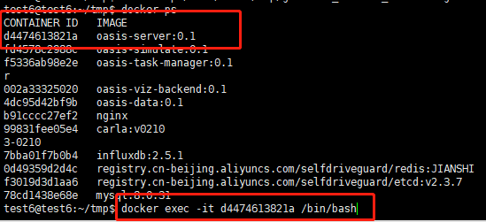
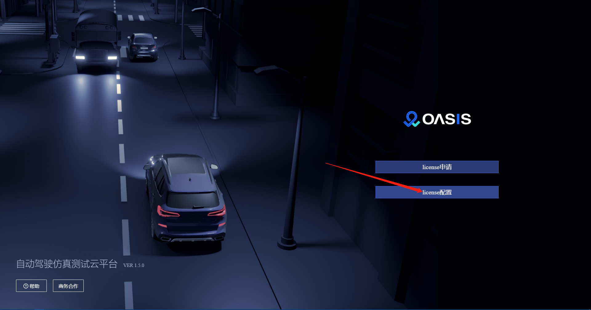

[上一页：场景说明](scenarios.md)

***

## License导入说明

1、启动oasis-server服务，可以看到如下页面

2、点击license申请按钮，进入license创建页面

- 参赛邮箱（填写在报名系统上[__报名的邮箱__](https://race.carsmos.cn/contests)）

- 参赛队伍名称（填写在报名系统上填写的队伍名称，系统根据邮箱自动带出队伍名称）

- 联系电话（参赛者填写自己的联系电话）

- 机器码（默认自动生成，用于唯一标识某一台机器，如果不能自动生成生成，请参考手动生成机器码如下所示）

3、正确填写后点击提交按钮，系统灰自动向报名邮箱发送授权license文件（邮箱附件下载）

4、返回首页，配置license，导入上一步下载下来的license授权文件

5、导入license授权成功后，启动按钮就会显示出来，点击启动进入oasis-server管理系统

***

[上一页：场景说明](scenarios.md)
