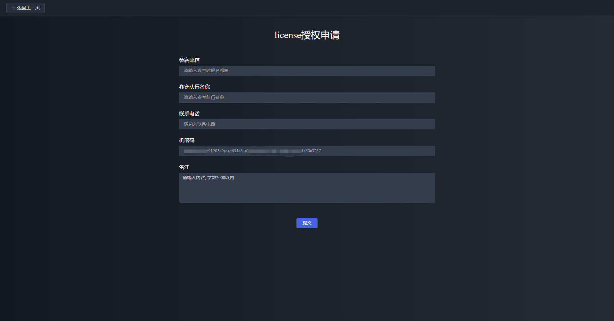
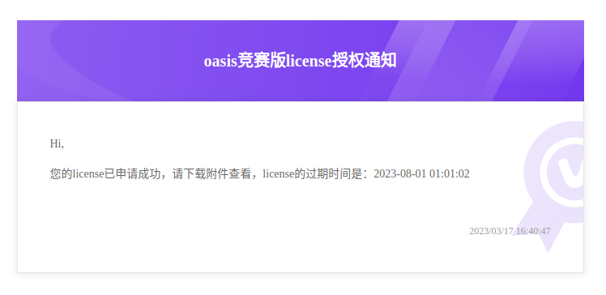
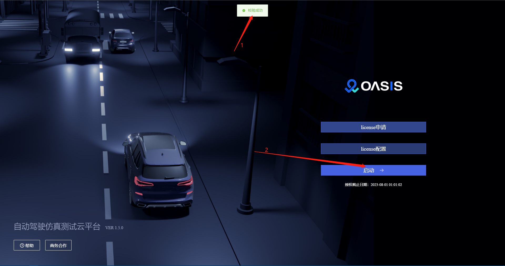

[上一页：场景说明](scenarios.md)

***

# 7 License导入说明

1、打开 Oasis 竞赛版，可以看到如下页面


2、点击 license 申请按钮，进入 license 创建页面



- `参赛邮箱`：填写在报名系统上[__报名的邮箱__](https://race.carsmos.cn/contests)）

- `参赛队伍名称`：填写在报名系统上填写的队伍名称，系统根据邮箱自动带出队伍名称

- `联系电话`：参赛选手填写自己的联系电话

- `机器码`：默认自动生成，用于唯一标识某一台机器
  
- 如果不能自动生成，请参考如下命令手动生成机器码

```bash
docker exec -it oasis-server /bin/bash
tar -zxvf generate_machine_code.tar.gz
./generate_machine_code/generate_your_machine_code.sh
```

如果运行成功，会生成机器码，可以将机器码复制粘贴到 Oasis 竞赛版的机器码输入框中：


3、正确填写后点击提交按钮，系统会自动向报名邮箱发送授权 license 文件（邮箱附件下载）



4、返回首页，配置 license，导入步骤 3 下载的 license 授权文件




5、导入 license 授权成功后，启动按钮就自动显示，点击启动进入 Oasis 竞赛版

***

[上一页：场景说明](scenarios.md)

[下一页：报名系统操作说明](signup.md)