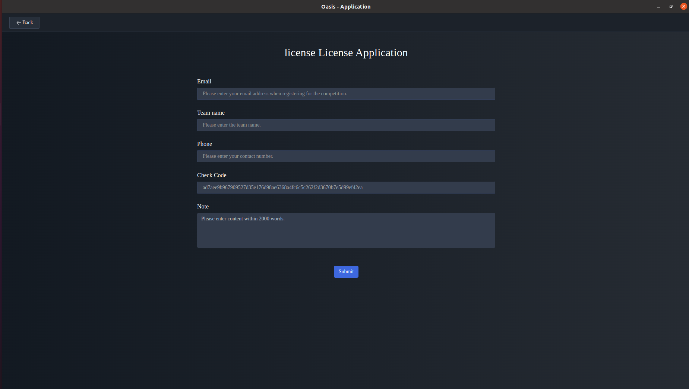
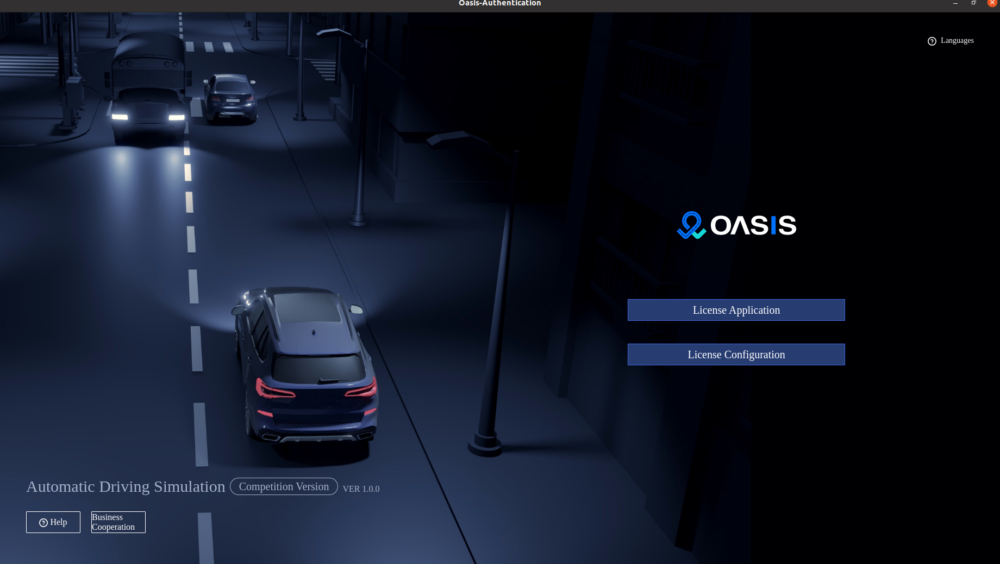
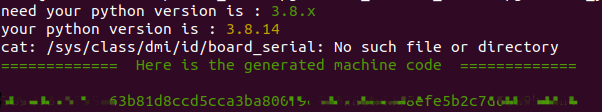
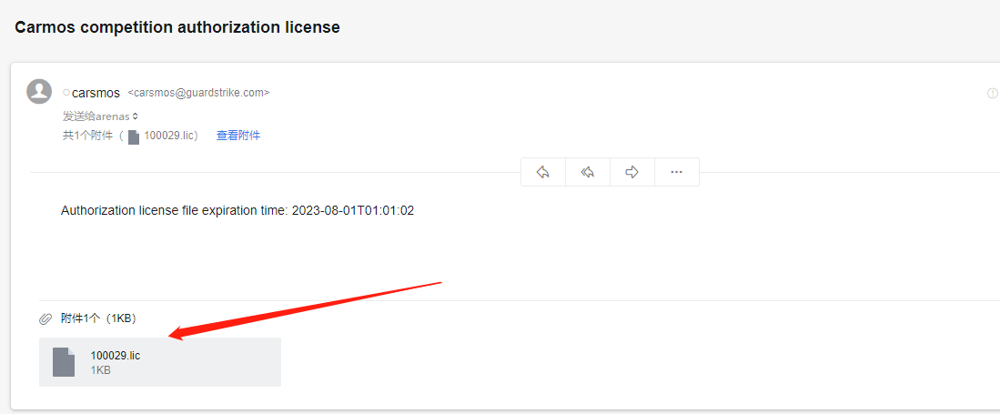

[Previous page: Scenario Description.](scenarios_en.md)

------

# 7 Instructions for Importing a License

1Opening the Oasis Competition Edition, you will see the following page:



2、Clicking on the "License Application" button will take you to the License Creation page.



- `Registration Email`：Please fill in the email address used for registration on the [__registration system__](https://race.carsmos.cn/contests)
- `Team Name`： Please fill in the team name that was registered on the registration system. The system will automatically fill in the team name based on the email used.
- `Contact Phone`：Participants should fill in their own contact phone number.
- `Machine Code`：Automatic generation of machine code is used by default to uniquely identify a machine.
- If the machine code cannot be generated automatically, please refer to the following command to generate the machine code manually.

```bash
docker exec -it oasis-server /bin/bash
tar -zxvf generate_machine_code.tar.gz
./generate_machine_code/generate_your_machine_code.sh
```

If the Oasis Competition Edition is launched successfully, it will generate a machine code. You can copy and paste this machine code into the machine code input box in the Oasis Competition Edition for validation and activation. 



3、After filling in the necessary information and clicking the "Submit" button, the system will automatically send the authorized license file to the registration email address as an attachment. You can download the license file from the email attachment and follow the instructions to import it into the Oasis Competition Edition.



4、To configure the license and import the license authorization file downloaded in step 3, follow these steps:


5、After the license import is authorized successfully, the "Startup" button will automatically appear. Click on the "Startup" button to enter the Oasis Competition Edition.

------

[Previous page: Scenario Description.](scenarios_en.md)

[Next page: Registration System Operation Instructions](signup_en.md)

