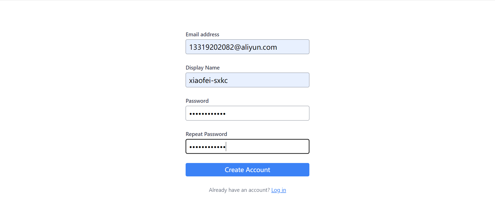
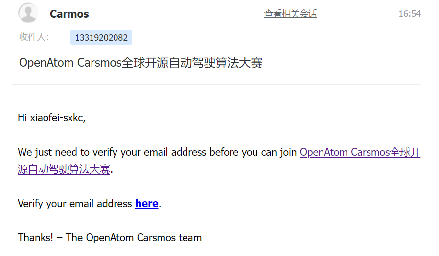
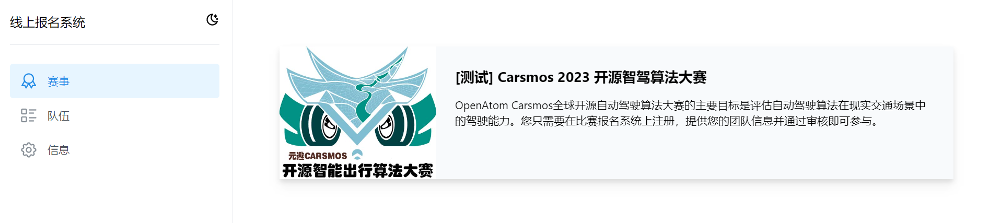
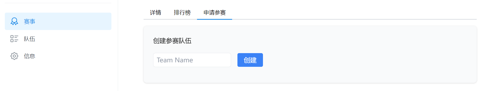
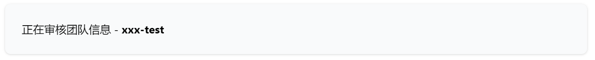
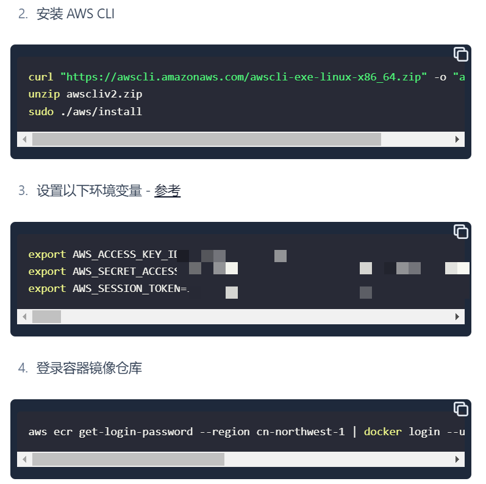

[Previous Page: License Import Instructions](license.md)

***
# 8 Registration System Operation Instructions

## 8.1 Registration Process
1. It is recommended to log in with AtomGit account.  

2. Click the link in the email to verify.  

3. Enter the system and select the Carsmos 2023 Open Source Autonomous Driving Algorithm Competition.  

4. Enter the team name and create a team.  

5. Select the created team, enter the team introduction and competition instructions, and click Apply to Participate.  

6. Wait for the approval.  

7. After approval, refresh the page to start submitting images.  

## 8.2 提交流程
1. Click "Add New Submission" to get the command, **copy and execute it directly on your local machine**.。  

2. Build the image.  

3. 构建镜像成功后，提交镜像  

***

[Next Page: Declaration Clause](clause.md)